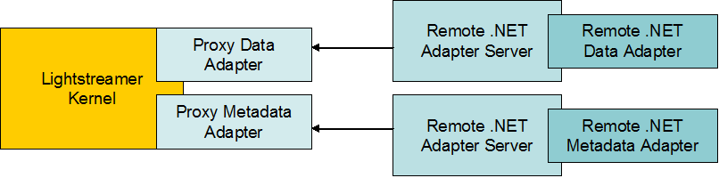

# Lightstreamer - Stock-List Demo - .NET Adapter #
<!-- START DESCRIPTION Stock-List Demo -->

This project contains the source code and all the resources needed to install a .NET version of the Stock-List Demo Data and Metadata Adapters.

## Dig the code ##
The application is divided into 5 main classes.

* <b>StockList.cs</b>: this is a C#/.NET porting of the [Lightstreamer - Stock-List Demo - Java Adapter](https://github.com/Weswit/Lightstreamer-example-StockList-adapter-java). It inherits from the <i>IDataProvider</i> interface and calls back Lightstreamer through the IItemEventListener interface. Use it as a starting point to implement your custom data adapter.<br>
* <b>LiteralBasedProvider.cs</b>: this is a C#/.NET implementation of the `LiteralBasedProvider` Metadata Adapter in  [Lightstreamer - Reusable Metadata Adapters - Java Adapters](https://github.com/Weswit/Lightstreamer-example-ReusableMetadata-adapter-java). It inherits from the IMetadataProvider interface. Use it as a starting point to implement your custom metadata adapter.<br>
* <b>ExternalFeed.cs</b>: this component simulates an external data feed that supplies quote values for all the stocks needed for the demos.
* <b>StandaloneLauncher.cs</b>: this is a stand-alone executable that launches both the Data Adapter and the Metadata Adapter for the .NET Stock-List Demo example. It redirects sockets connections from Lightstreamer to the .NET Servers implemented in the LS .NET SDK library and does not rely on the .NET Server wrapper provided.<br>
* <b>Log4NetLogging.cs</b>: used by the stand-alone executable to forward the log produced by the LS .NET SDK library to the application logging system, based on log4net.<br>

Check out the sources for further explanations.<br>

<b>NOTE: At this stage, the demo is based on a version of LS .NET SDK that is still to be released. Skip the notes below and refer to the "for_Lightstreamer_5.1.1" tag for a demo version suitable for building and deploying.</b>

<!-- END DESCRIPTION Stock-List Demo -->
# Build #

If you want to skip the build process of this Adapter please note that in the [deploy release](https://github.com/Weswit/Lightstreamer-example-StockList-adapter-dotnet/releases) of this project you can find the "deploy.zip" file that contains a ready-made deployment resource for the Lightstreamer server.<br>
Otherwise to recompile the provided sources, you just need to create a project for a library target, name it "DotNetStockListDemo_N2", then include the sources ("src/src_data_adapter") and include references to the Lightstreamer .NET Adapter Server library binaries (see DOCS-SDKs/sdk_adapter_dotnet/lib/ folder of your Lighstreamer home) and suitable Log4net library binaries.<br>

## Build the Stand-alone launcher ##
To recompile the provided source, you just need to create a project for a console application target, name it "DotNetStockListDemoLauncher_N2", then include the source ("src/src_standalone_launcher") and include references to the Lightstreamer .NET Adapter Server library binaries (see above), the Log4net library binaries (see above) and .NET Stock-List Demo Data Adapter binaries you have got from the above source code. Make sure that the entry point of the executable is the ServerMain class.

# Deploy #



To test the .NET Adapter follow this simple process below.
The instructions provided refer to the "Deployment" directory you can find in the "deploy.zip" file of [latest release](https://github.com/Weswit/Lightstreamer-example-StockList-adapter-dotnet/releases).

1. Make sure that Lightstreamer Server is not running.
2. Plug the new Adapter Set into the Server. Just copy the "DotNetStockList" directory and all of its files to the "adapters" subdirectory in your Lightstreamer Server installation.<br>
2.1. Alternatively, copy the Deployment_LS(robust)\DotNetStockList directory and all of its files into "adapters". This Adapter Set demonstrates the provided "robust" versions of the standard Proxy Data and Metadata Adapters. The robust Proxy Data Adapter can handle the case in which a Remote Data Adapter is missing or fails, by suspending the data flow and trying to connect to a new Remote Data Adapter instance. The robust Proxy Metadata Adapter can handle the case in which a Remote Metadata Adapter is missing or fails, by temporarily denying all client requests and trying to connect to a new Remote Data Adapter instance. See the comments embedded in "adapters.xml" for details. Note that this extended Adapter Set also requires that the client is able to manage the case of missing data. Currently, only the [Lightstreamer - Stock-List Demo - HTML Client](https://github.com/Weswit/Lightstreamer-example-StockList-client-javascript#stocklist-demo) and the [Lightstreamer - Framed Stock-List Demo - HTML Client](https://github.com/Weswit/Lightstreamer-example-StockList-client-javascript#framed-stocklist-demo) front-ends have such ability.
3. Launch the Remote .NET Adapter Server. The .NET Server resources can be found under Deployment_DotNet_Server. Run the DotNetServers.bat script. The script runs the two instances of the .NET Server (one for the Remote Metadata Adapter and the other for the Remote Data Adapter).<br>
3.1. Alternatively, run the DotNetCustomServer.bat script under the "Deployment_DotNet_Server(custom)" Directory. The script runs the DotNetStockListDemoLauncher_N2.exe Custom Launcher, which hosts both the Remote Data Adapter and the Remote Metadata Adapter for the .NET Stock-List Demo.
4. Lightstreamer Server is now ready to be relaunched. The Server startup will complete only after a successful connection between the Proxy Adapters and the Remote Adapters.
5. Please test your Adapter with one of the front-end pages in this [list](https://github.com/Weswit/Lightstreamer-example-StockList-adapter-dotnet#clients-using-this-adapter).

<i>NOTE: In order to make the Stock-List Demo front-end pages consult the newly installed Adapter Set, you need to modify the front-end pages and set the required Adapter Set name to STOCKLISTDEMO_REMOTE when creating the LightstreamerClient instance.
So a line like this:
```js
  var sharingClient = new LightstreamerClient(hostToUse,"DEMO");
```
becomes like this:
```js
  var sharingClient = new LightstreamerClient(hostToUse, "STOCKLISTDEMO_REMOTE");
```
(you don't need to reconfigure the Data Adapter name, as it is the same in both Adapter Sets).

Moreover, as the referred Adapter Set has changed, make sure that the front-end does no longer share the Engine with demos.
So a line like this:
```js
  sharingClient.connectionSharing.enableSharing("DemoCommonConnection","ls/","SHARE_SESSION", true);
```
should become like this:
```js
  sharingClient.connectionSharing.enableSharing("RemoteStockListConnection","ls/","SHARE_SESSION", true);
```
The Stock-List Demo web front-end is now ready to be opened. The front-end will now get data from the newly installed Adapter Set.</i>

You can refer to Deployment_DotNet_Server\DotNetServers.bat as an example on how to start the .NET Server manually.
In case of need, the .NET Server prints on the log a help page if run with the following syntax: "DotNetServer /help".

Please note that the .NET Server connects to Proxy Adapters, not vice versa.

Please refer to the [LS DotNet Adapters.pdf](http://www.lightstreamer.com/latest/Lightstreamer_Allegro-Presto-Vivace_5_1_Colosseo/Lightstreamer/DOCS-SDKs/sdk_adapter_dotnet/doc/DotNet%20Adapters.pdf) document for further deployment details.<br>
The standard type of configuration is shown, where the process which runs the Remote Adapters is manually launched beside Lightstreamer Server.
On the other hand, two different examples of manual launch of the remote process are shown, one based on the provided Remote Server and one based on a custom server program, also shown.
  
# See Also #

## Clients using this Adapter ##

<!-- START RELATED_ENTRIES -->

* [Lightstreamer - Stock-List Demos - HTML Clients](https://github.com/Weswit/Lightstreamer-example-Stocklist-client-javascript)
* [Lightstreamer - Stock-List Demo - Dojo Toolkit Client](https://github.com/Weswit/Lightstreamer-example-StockList-client-dojo)
* [Lightstreamer - Stock-List Demo - PhoneGap Client](https://github.com/Weswit/Lightstreamer-example-StockList-client-phonegap)
* [Lightstreamer - Portfolio Demos - HTML Clients](https://github.com/Weswit/Lightstreamer-example-Portfolio-client-javascript)
* [Lightstreamer - Portfolio Demo - Dojo Toolkit Client](https://github.com/Weswit/Lightstreamer-example-Portfolio-client-dojo)
* [Lightstreamer - Basic Stock-List Demo - jQuery (jqGrid) Client](https://github.com/Weswit/Lightstreamer-example-StockList-client-jquery)
* [Lightstreamer - Basic Stock-List Demo - Java SE (Swing) Client](https://github.com/Weswit/Lightstreamer-example-StockList-client-java)
* [Lightstreamer - Basic Stock-List Demo - .NET Client](https://github.com/Weswit/Lightstreamer-example-StockList-client-dotnet)
* [Lightstreamer - Stock-List Demos - Flex Clients](https://github.com/Weswit/Lightstreamer-example-StockList-client-flex)
* [Lightstreamer - Stock-List Demos - Flash Clients](https://github.com/Weswit/Lightstreamer-example-StockList-client-flash)
* [Lightstreamer - Basic Stock-List Demo - BlackBerry (WebWorks) Client](https://github.com/Weswit/Lightstreamer-example-StockList-client-blackberry10-html)

<!-- END RELATED_ENTRIES -->

## Related projects ##
* [Lightstreamer - Stock-List Demo - Java Adapter](https://github.com/Weswit/Lightstreamer-example-StockList-adapter-java)
* [Lightstreamer - Reusable Metadata Adapters - Java Adapter](https://github.com/Weswit/Lightstreamer-example-ReusableMetadata-adapter-java)

# Lightstreamer Compatibility Notes #

- Compatible with Lightstreamer SDK for .NET Adapters since 1.8
- For a version of this example compatible with Lightstreamer SDK for .NET Adapters version 1.7, please refer to [this tag](https://github.com/Weswit/Lightstreamer-example-StockList-adapter-dotnet/tree/for_Lightstreamer_5.1.1).
